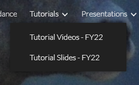
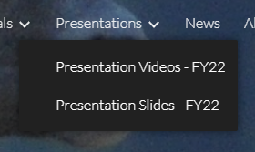

LDMS Users Group Conference (LDMSCON)
###########
The LDMS Users Group Conferences (LDMSCON) serves as a forum for users to share experiences with the LDMS product.

About
**********
You can find the general information and previous conferences following webpage: 
`LDMS Users Group Conference`_.

.. _LDMS Users Group Conference: https://sites.google.com/view/ldmscon

Please go to the <insert-link> to stay up to date on tutorials, presentations and discussions about LDMS and its' software capabilities.
------------

LDMSCON2023
************
The following attachment contains the scripts and commands used in the LDMCON2023 Basics powerpoint presentation. 

**Please DOWNLOAD THE FOLLOWING .ZIP FILE to easily follow along with the tutorial.**

:download: `ldmscon2023_directory.zip <https://github.com/ovis-hpc/readthedocs/blob/main/files/ldmscon2023_directory.zip>`_

Recordings of previous presentations, tutorials and information for LDMSCON2023 can be found here:
`LDMSCON2023 <https://sites.google.com/view/ldmscon2023>`_

* The tutorial videos and slides can be viewed under the "Tutorials" tab at the top right.
.. image:: images/ldmscon/ldmscon2023pres.PNG
   :width: 200
* The presentation videos and slides can be viewed under the "Presentations" tab at the top right.
.. image:: images/ldmscon/ldmscon2023tutorial.png
   :width: 200

.. note::
  
  **If the file directory ``ldmscon2023`` is not extracted under ``/root/``** then please keep in mind that **any reference to ``/root/``** in the powerpoint presentation, and following files, **will need to be changed to the absolute path of ``ldmscon2023/``**.

   * ``../conf/e3/agg_store_csv.conf``
   * ``../scripts/e1/start_ldms_simple.sh``
   * ``../scripts/e2/start_ldms_simple_agg.sh``
   * ``../scripts/e3/start_agg_store_csv.sh``
   * ``../scripts/e3/store_csv.txt``

.. note::
   All files under ``../scripts/e*`` are not used in the tutorial but rather are the commands/steps used for each exercise. They demonstrate LDMS's ability to configure and initialize it's daemons with a single bash script. 

.. note:: 
   These scripts must be ran in a directory that is readable and writable. Otherwise the log/data file generation will not work.

LDMSCON2022
************
Recordings of previous presentations, tutorials and information for LDMSCON2022 can be found here:
`LDMSCON2022 <https://sites.google.com/view/ldmscon2022>`_

* The tutorial videos and slides can be viewed under the "Tutorials" tab at the top right.

* The presentation videos and slides can be viewed under the "Presentations" tab at the top right.

Archived LDMSCONs
************
All LDMSCONs prior to 2022 have been archived and can be found here:
`Archived LDMSCONs <https://sites.google.com/view/ldmscon/archived>`_

